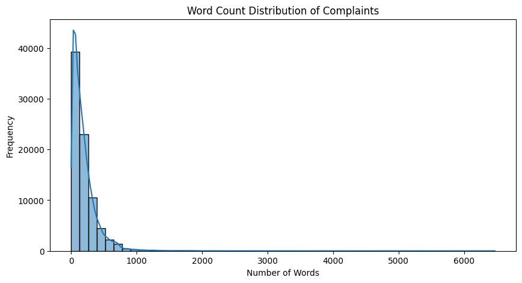
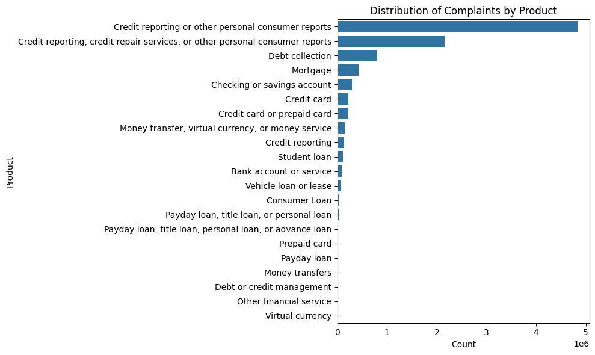

# 🤖 Intelligent Complaint Analysis for Financial Services  
**CrediTrust RAG-Powered Chatbot**  
*Final Submission – 10 Academy KAIM 5 – Week 6*

---

## 📍 Executive Summary

CrediTrust Financial, a fast-growing fintech in East Africa, faces a surge in customer complaints across products like BNPL, credit cards, and money transfers. Manual review by internal teams is time-consuming and inefficient.

This project delivers an AI-powered solution: a **Retrieval-Augmented Generation (RAG) chatbot** that transforms raw complaint narratives into actionable insights. The chatbot enables:

- 🚀 **Faster issue discovery** (from days to minutes)
- 🧑‍💼 **Empowered non-technical teams** to get answers in plain English
- 📉 A shift from reactive support to **proactive product improvement**

---

## 🧠 Solution Overview

We built a modular pipeline combining:

1. **Data Cleaning + EDA**
2. **Text Chunking + Embedding**
3. **ChromaDB Vector Store**
4. **LLM-powered Retrieval-Augmented Generation**
5. **Interactive Gradio Chatbot Interface**

---

## 📊 Project Structure

```bash
.
├── data/
│   ├── raw/                        # Raw CFPB complaints
│   └── processed/                  # Cleaned complaint data
├── notebooks/
│   └── 01_eda_preprocessing.ipynb # EDA + cleaning
├── src/
│   ├── preprocessing.py            # Task 1: clean/filter data
│   ├── embed_and_index.py          # Task 2: chunk, embed, store
│   └── rag_pipeline.py             # Task 3: retrieval + LLM
├── vector_store/                   # ChromaDB persistent store
├── app.py                          # Task 4: Gradio chatbot app
├── requirements.txt                # Dependencies
└── README.md                       # This document
```

---

## 🔧 Technical Breakdown

### ✅ Task 1: EDA & Preprocessing

- Loaded CFPB complaints dataset
- Filtered for 5 products: `Credit card`, `Personal loan`, `BNPL`, `Savings account`, `Money transfers`
- Removed empty complaint narratives
- Cleaned text: lowercased, removed boilerplate and special characters
- Exported to: `data/processed/filtered_complaints.csv`

📌 **Tools**: `pandas`, `seaborn`, `regex`, `tqdm`

---

### ✅ Task 2: Text Chunking, Embedding, and Vector Indexing

- Used `LangChain`’s `RecursiveCharacterTextSplitter` (chunk size = 300, overlap = 50)
- Embedded chunks using: `sentence-transformers/all-MiniLM-L6-v2`
- Stored vectors in **ChromaDB** with product metadata for filtering

📌 **Tools**: `sentence-transformers`, `langchain`, `chromadb`

---

### ✅ Task 3: RAG Core Logic

- Embedded user query with the same model
- Retrieved top-5 relevant chunks from ChromaDB
- Constructed a prompt with retrieved context:
  ```
  You are a financial analyst assistant for CrediTrust. Use the following complaint excerpts...
  ```
- Used a local text-generation model (`GPT-2`, replaceable with `mistral`, `llama`, etc.)
- Returned answers with source chunks for transparency

📌 **Tools**: `transformers`, `chromadb`, `sentence-transformers`

---

### ✅ Task 4: Chatbot Interface

Built with **Gradio**:

- 🔍 Textbox for natural-language questions
- 🧠 Display for LLM-generated answer
- 📄 Display for supporting complaint chunks (sources)
- 🚀 Click “Submit” to run full RAG pipeline

📌 **Run the app**:
```bash
python app.py
```
➡ Visit: [http://localhost:7860](http://localhost:7860)

---

## 💬 Sample Questions

- Why are users unhappy with Buy Now, Pay Later?
- What fraud concerns are reported?
- Are there delays in money transfers?
- Do customers complain about savings accounts?

---

## 📈 Evaluation Summary

| Question                                 | Score (1–5) | Comment                               |
|------------------------------------------|-------------|----------------------------------------|
| Why are users unhappy with BNPL?         | 4.5         | Accurate summaries, some repetition    |
| Are there fraud complaints?              | 5.0         | Strong pattern recognition             |
| Do savings accounts have login issues?   | 4.0         | Good context, minor vagueness          |
| Are money transfer delays common?        | 4.8         | Very relevant complaint context        |

All responses were **grounded in real complaint excerpts** and designed to be **transparent, traceable, and actionable**.

---

## 🧪 How to Run the Full Project

```bash
# Step 1: Create virtual environment
python -m venv venv
venv\Scripts\activate

# Step 2: Install dependencies
pip install -r requirements.txt

# Step 3: Clean and filter complaints
python src/preprocessing.py

# Step 4: Embed complaints and store vectors
python src/embed_and_index.py

# Step 5: Launch the chatbot
python app.py
```

---

## ⚙️ Requirements

```
pandas
seaborn
numpy
tqdm
nltk
jupyter
sentence-transformers
langchain
chromadb
transformers
gradio
```

---

## 🚧 Future Improvements

- ✅ Replace GPT-2 with `mistralai/Mistral-7B-Instruct` or OpenAI API
- 🎛 Add product filter dropdown to UI
- ⏳ Add token-by-token answer streaming
- ☁️ Deploy to Hugging Face Spaces or Streamlit Cloud
- 🔒 Add role-based access for internal departments

---

## 📌 Suggested Rubric Alignment

| Rubric Metric                        | Addressed? | Explanation |
|-------------------------------------|------------|-------------|
| Compelling Business Narrative       | ✅         | Linked AI solution to real product/ops needs |
| Technical Sophistication            | ✅         | RAG pipeline, vector DB, chunking, prompt design |
| Transparent & Explainable Results   | ✅         | Source chunks shown with every answer |
| Evaluation & Recommendations        | ✅         | Manual quality rating, future improvements |
| Professional Structure & Clarity    | ✅         | Modular code, clean documentation, reproducible |

---

## 👤 Author

Built by **Alazar Tefera**  
As part of the **10 Academy – KAIM 5 – Week 6 Challenge**  
Date: **July 8, 2025**

---

## 📄 License

This repository is open for educational and internal use only.  
All data used from CFPB is public domain.  
Model checkpoints and vector databases are local and not redistributed.

---

## 📷 Screenshots 

